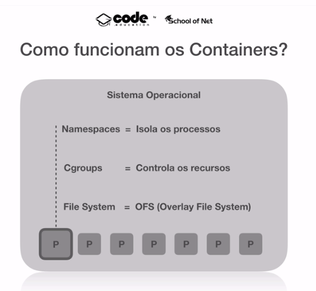
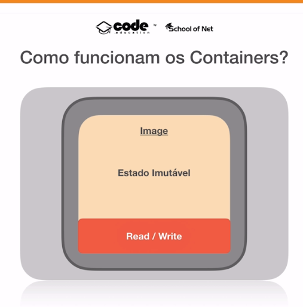
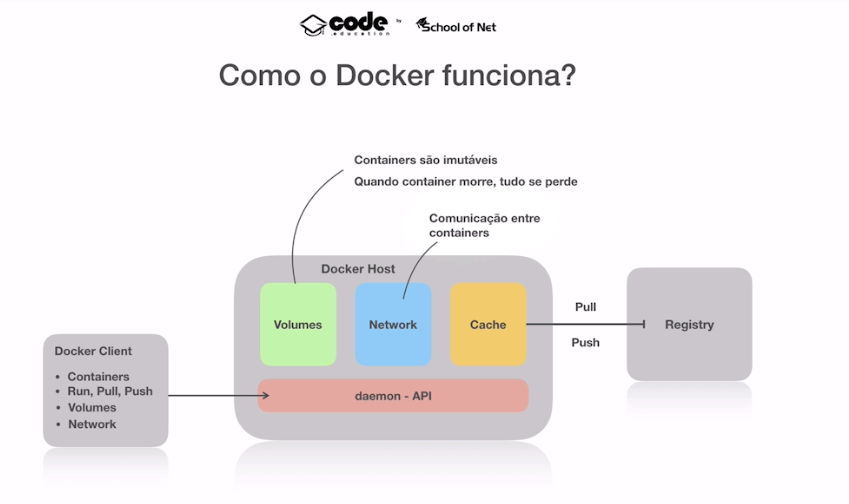

# Docker

## Starting from zero

So, what are containers ?

Documentation says: "A container is a standard unit of software that packages up code and all its dependencies so the application runs quickly and reliably from one computing environment to another. A Docker container image is a lightweight, standalone, executable package of software that includes everything needed to run an application: code, runtime, system tools, system libraries and settings."

3 Pilar of Container

- Namespace
- CGroups
- File System




Disclaimer: Container are not lightweight virtual machine

Deep diving:

- Namespaces => Isolate de process
- Parent process 1
-  - Subprocess 1
-  - Subprocess 2
- Parent process 2
-  - Subprocess 1
-  - Subprocess 2

When container run, it's a Parent process with Namespace that figure a OS, so the namespace can't see the others process running.

### Namespace:

- PID
- User
- Network
- Filesystem

### Cgroups:

Cgroups control of resources

how?

Imagine you have a computer of 16gb ram, and the process has a memory leak, it can hurt others processes.

With CGroups we can limit the resource like:

memory = 1gb

cpu_shares = 512

### File system - OFS (Overlay File System)

This FS work with Layers.

Different from EC2, or another VM, I dont need the whole OS Snapshot. 

For example, if i have 2 Containers MyApp:v1 that has 2 dependencies ( 200mb each one )

The MyApp:v2 if it has same dependencies, i dont need download it again. We dont need full copy files.

With Container we dont need whole OS like ubuntu, debian, but just the necessary files. The Kernel and libraries is shared by "host".

### Images

Layers:

-> Scratch

--> Part of Ubuntu

---> Bash ( layer of ubuntu )

---> ssh.d  ( layer of ubuntu )

----> MyApp:v1  ( layer of ssh.d )

If we have some problems with Layer ubuntu, we can change this layer and will not affect others parts.

Images has:
- name 
- version (optional, but necessary)



Images are immutable, so if you change something, it will create a new layer.

If you stop a container, it will not delete the container, but if you remove the container, it will delete the container. And all write layer will be deleted.

### Dockerfile

From dockerfile, we can create a image.


# Docker Host

Docker Host is the machine that run the docker.

- Daemon API
- Cache
- Volumes ( Container are immutable, so we need a place to store the data)
- Network ( Communication between containers)

# Registry

Registry is the place that store the images.
- Push
- Pull

# Docker Client

Docker Client has the commands to interact with Docker Host.
- Container
- Run, pull, push
- Volumes



## Starting with Docker


### List Docker Containers

```bash
docker ps
```

### Install image

```bash
docker run node
Unable to find image 'node:latest' locally # if not found, it will download
latest: Pulling from library/node
# ...
```

### Interative mode

```bash
docker run -it node
```

### List all container ( running and stopped )

```bash
docker ps -a
CONTAINER ID   IMAGE   COMMAND                 CREATED         STATUS                     PORTS                    NAMES
c0618402c677   node    "docker-entrypoints…"   3 minutes ago   Exited (0) 3 seconds ago focused_lewin
```

### Remove container after exit

```bash
docker run -it --rm node
```

### Run container in background

```bash
docker run -d node
```

### Publish port

```bash
docker run -d -p 3000:80 nginx
```

Setting name

```bash
docker run -d --name webserver -p 3000:80 nginx
```

Execute command in container

```bash
docker run -d --name webserver -p 3000:80 nginx
a46caeeee188e157a44a7e070b43c49d3baaa9fd29bb0eaaa4c596c6a634a343
➜  course-fullcycle-3.0 git:(main) ✗ docker exec webserver ls
bin
boot
dev
docker-entrypoint.d
docker-entrypoint.sh
etc
home
lib
media
mnt
opt
proc
root
run
sbin
srv
sys
tmp
usr
var
```

Execute bash and detach

```bash
docker exec -it webserver bash
```

### Bind mount using local folder

```bash
docker run -d --name webserver -v $(pwd)/html:/usr/share/nginx/html -p 3000:80 nginx
```

### Using mount

```bash
docker run -d --name webserver --mount type=bind,source="$(pwd)/html",target=/usr/share/nginx/html -p 3000:80 nginx
```

### Remove all container running

```bash
docker rm -f $(docker ps)
```

# Volumes

### Create a new volume

```bash
docker volume create alekinho
```

### List volumes

```bash
docker volume ls
```

### Remove volume

```bash
docker volume rm alekinho
```

### Inspect 

```bash
docker volume inspect alekinho
[
    {
        "CreatedAt": "2023-05-31T21:25:12Z",
        "Driver": "local",
        "Labels": null,
        "Mountpoint": "/var/lib/docker/volumes/alekinho/_data",
        "Name": "alekinho",
        "Options": null,
        "Scope": "local"
    }
]
```

### Bind mount

```bash
docker run --name nginx -d  --mount type=volume,source=alekinho,target=/app nginx
b7921a3aedfbcccb987a6d9aa5171d030bbc8819ab59a0b1f2f00e3e190f173b
```

If i create a file in /app, it will be created in volume.

```bash
docker exec -it nginx bash
root@b7921a3aedfb:/# cd app/
root@b7921a3aedfb:/app# touch oi.txt
root@b7921a3aedfb:/app# ls
file.txt
```

Now, if i create a new container, it will have the oi.txt

```bash
docker run --name nginx2 -d  --mount type=volume,source=alekinho,target=/app nginx
ce397a54e2f5c764c74289bab36ffbc3a214d0f37b05eebb918a406d2814b98e
➜  ~ docker exec -it nginx2 bash
root@ce397a54e2f5:/# cd app/
root@ce397a54e2f5:/app# ls
oi.txt
```

Create now nginx3 just with bind mount with -v

```bash
docker run --name nginx3 -d  -v alekinho:/app nginx
```


# Tips

To delete volumes that are not used by any container

```bash
docker volume prune
```

example:

```bash
1_starting_with_docker git:(main) ✗ docker volume prune
WARNING! This will remove all local volumes not used by at least one container.
Are you sure you want to continue? [y/N] y
Deleted Volumes:
5754d89edffb8f8ef0b7ab0e01a53f2dcf27e9aa0cd586112d3eeda269b55098
01f7219bc39a90dc7dee20d9191eba9de0027e4dc7b3cad3279481154ecd13c5
0e9fede613b2f57bd831bb56e111c932fd2c76a8442c9b8619e13d7f161aa439
246ab8de7ae7243d866922d527d7b6bbcf574eae265f8c347bef9bab5d42525a
9f3e99afa55ffe00863edb3fbee69aa10c68dfc8d4f626983585e81527d584aa
grafana-influx_chronograf-storage
grafana-influx_influxdb-storage
89924bf7d55f6aa8c373b2555c42eee2f0c2772509ef60577f0148e514213f9a
f894fe3a1e4f366f2b6b1bd3a58eebc064ec83d55cf33ad4b36c094cc60f305c
grafana-influx_grafana-storage
4f91e5bac9d74a76c5aa693a1557ed5f5334a6d540805ca2a85b919b4010b306

Total reclaimed space: 120.4MB
```